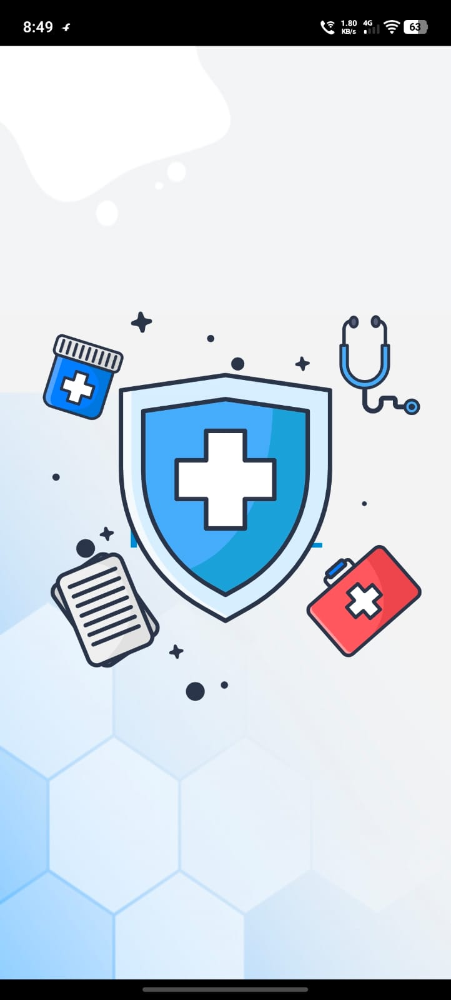
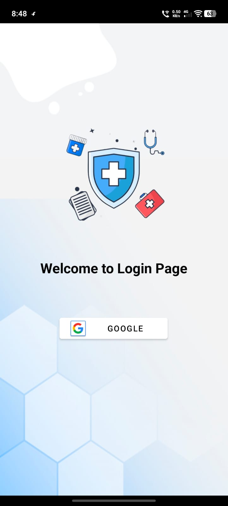
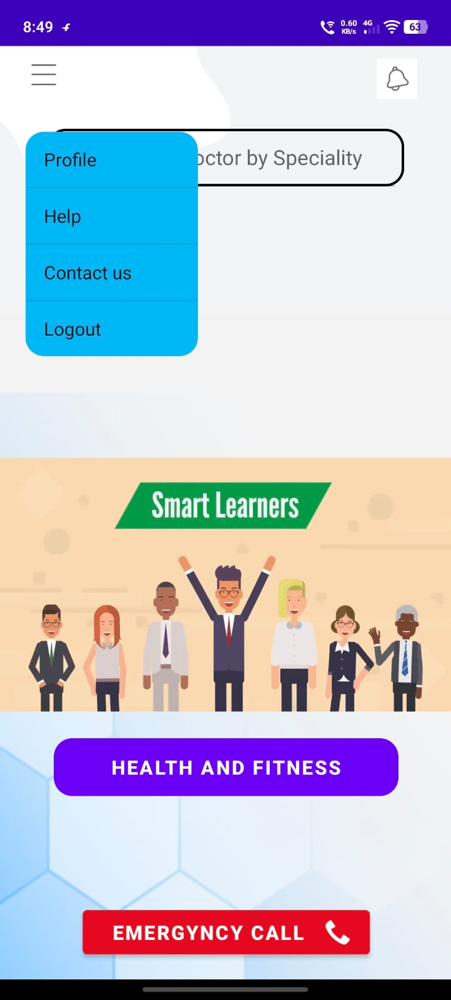
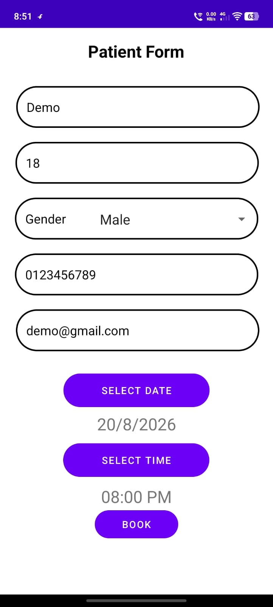
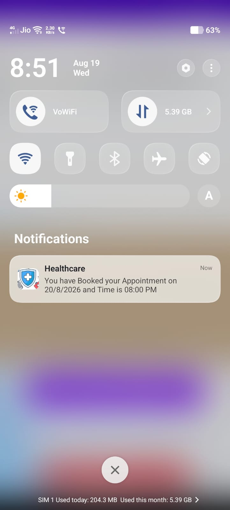
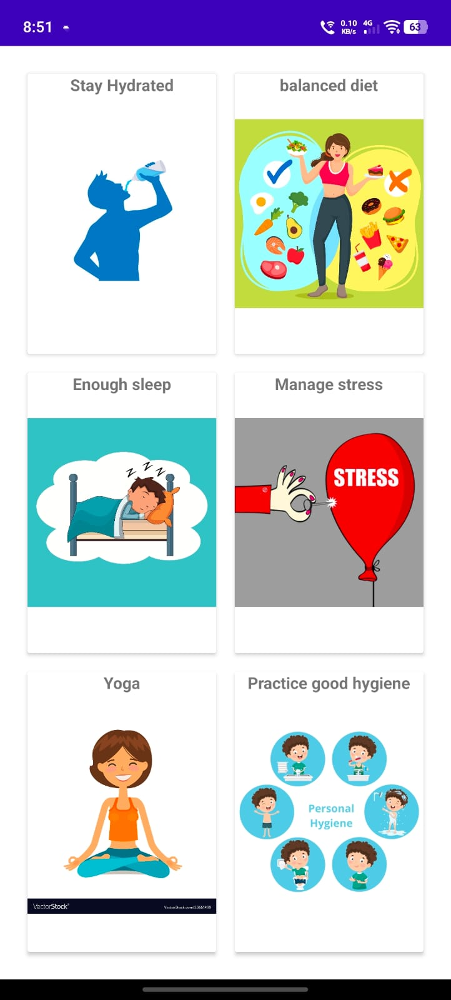

# Hospital Management & Healthcare App

An Android-based healthcare application developed using **Java** and **XML**. The application provides users with healthcare-related information, patient management features, appointment booking, notifications, user profiles, and health and wellness resources.

## Features

* User Login and Registration
* Admin Login
* Patient Management
* Patient List
* Appointment Booking
* User Profile
* Notifications
* Health and Fitness Information
* Disease Information
* Contact Us
* Help Section
* Splash Screen

## Appointment Management

The application provides functionality related to:

* Appointment booking
* Patient appointment management
* Appointment information handling
* Patient information management

## Health & Wellness

The application provides healthcare information and wellness resources covering:

### Diseases & Health Conditions

* Arthritis
* Asthma
* Cancer
* Diabetes
* Normal Fever
* Tuberculosis

### Health & Wellness Resources

* Balanced Diet
* Good Hygiene
* Sleep
* Stress Management
* Water
* Yoga

## User Modules

### User

* Login and registration
* Access healthcare information
* View health and wellness resources
* Manage profile
* Access appointment-related functionality
* Receive notifications

### Administrator

* Admin login
* Access administrative functionality
* Manage patient-related information

## Technologies Used

* **Java**
* **XML**
* **Android SDK**
* **Android Studio**
* **Git & GitHub**

## Android Components

The project uses multiple Android components and classes for implementing the application, including:

* Activities
* XML layouts
* Adapter classes
* Model classes
* Android resources
* Notifications
* Android Manifest configuration

## Project Structure

```text
Hospital/
├── app/
│   └── src/
│       └── main/
│           ├── java/
│           │   └── com/example/hospital/
│           ├── res/
│           │   ├── drawable/
│           │   ├── drawable-v24/
│           │   ├── font/
│           │   ├── layout/
│           │   ├── raw/
│           │   ├── values/
│           │   └── xml/
│           └── AndroidManifest.xml
│
├── gradle/
│   └── wrapper/
│
├── .gitignore
├── build.gradle
├── gradle.properties
├── gradlew
├── gradlew.bat
└── settings.gradle
```

## Application Screens

The application contains multiple screens for different modules, including:

* Splash Screen
* Login
* Registration
* Admin Login
* Main Dashboard
* Patient List
* Profile
* Appointment Booking
* Notifications
* Health & Fitness
* Disease Information
* Contact Us
* Help
* Health & Wellness Resources

## Screenshots

| Splash Screen | Login |
|---|---|
|  |  |

| Dashboard | Appointment Booking |
|---|---|
|  |  |

| Appointment Notification | Health Information |
|---|---|
|  |  |
## How to Run

1. Clone this repository.
2. Open the project in **Android Studio**.
3. Allow Android Studio to sync the Gradle files.
4. Connect an Android device or start an Android Emulator.
5. Build and run the application.

## Future Enhancements

* Online doctor consultation
* Advanced appointment scheduling
* Improved notification and reminder functionality
* Additional healthcare and wellness resources
* Enhanced patient management features

## Author

**Prathamesh Surve**

Computer Engineering | Android & Software Development

GitHub: **[PrathameshSurve1509](https://github.com/PrathameshSurve1509)**
